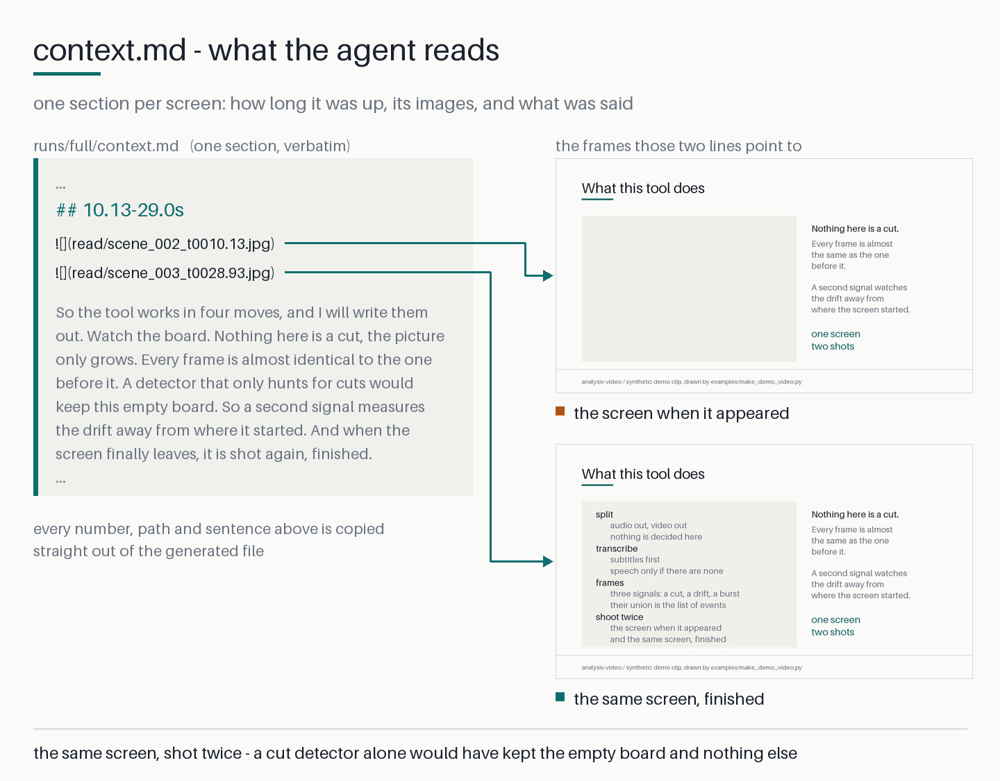
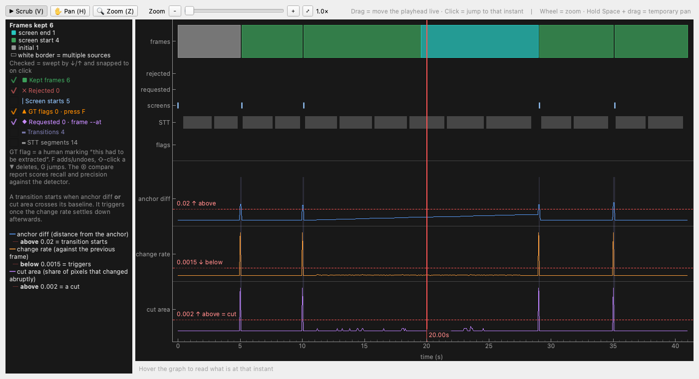

# analysis-video — 영상을 AI가 읽을 수 있는 형태로

**강의·화면녹화·슬라이드 영상을 LLM이 실제로 읽을 수 있는 마크다운 한 파일로 바꾸는 CLI.
화면 이미지 + 그 화면이 떠 있던 시간 + 그동안의 대사를 화면 단위로 정렬해 내보낸다.**

[](https://pypi.org/project/analysis-video/)
[](https://github.com/hwanyong/analysis-video/actions/workflows/ci.yml)
[](#지원-환경)
[](LICENSE)

[English README](README.md)



*아래 데모 영상의 한 화면. 왼쪽 마크다운은 산출물 원문 그대로이고, 오른쪽 두 장이 그
`` 가 가리키는 이미지다. 판이 한 줄씩 채워지는 화면이라 빈 판과 완성된 판이 둘 다
남았다 — 컷만 보는 검출기였다면 빈 판 하나만 남았을 자리다.*

유튜브 영상을 분석시키면 Claude는 **자막만 읽는다.** 자막이 나쁜 재료라서가 아니다 —
사람이 적은 원문이라 고유명사도 숫자도 흔들리지 않는다. 문제는 그것만으로는 **절반**이라는
것이다. 화면에 쓰고, 그리고, 코딩하고, 띄운 것은 자막 어디에도 없다.
이 도구는 **그 자막을 대사로 그대로 쓰면서** 빠진 절반을 채운다.

`analysis-video` 는 고정 간격이 아니라 **화면이 얼마나 변했는지**를 기준으로 프레임을 뽑아,
**구별되는 화면마다 이미지 한 장, 그 화면이 떠 있던 시간 구간, 그동안 오간 말**을 마크다운
한 파일로 남긴다 — grep 하고, 색인하고, 버전 관리하고, 어떤 모델에든 넘길 수 있다.

**소비자가 사람이 아니라 AI 에이전트라는 전제**로 설계했다. 호출당 stdout에 JSON 한 덩어리,
분기는 종료코드만으로, 경로는 전부 절대경로, 스테이지는 재개 가능.

```bash
uvx analysis-video@latest analyze lecture.mp4
# → lecture.mp4.analysis/runs/full/context.md
```

API 키가 필요 없다. 업로드도 없다. **영상이 기기 밖으로 나가지 않는다.**

---

## 결과물

```markdown
## 63.13-87.73s


N1 없이 커지면 BN이라는 값도 당연히 1 없이 커지게 됩니다. ...
```

한 항목이 한 화면이다. 이미지가 두 장이면 같은 화면의 등장 직후와 사라지기 직전이고,
필기나 단계적으로 채워지는 슬라이드에서는 **두 번째가 완성된 판서**다. 대사는 전체 전사가
화면들에 빠짐없이 한 번씩 배분된다.

가리키는 이미지는 `read/` 의 **읽기용 축소 사본**이다. 원본 해상도는 같은 파일명으로
`frames/` 에 그대로 남고, 사본의 크기는 `--read-long-edge` 로 정한다. 디스크가 아니라
**컨텍스트 창** 때문에 하는 일이다 — 실측으로 사본 한 장이 원본 해상도 한 장의
**4.17분의 1 토큰**이고, 그 차이가 1시간 강의를 100만 토큰 창에 넣을 수 있느냐 없느냐를
가른다. `context.md` 는 첫 문단에서 사본 크기·장수·전부 열었을 때의 대략적인 토큰을
스스로 밝히므로, 읽는 쪽이 **열기 전에** 몇 장을 열지 정할 수 있다.

### 저장소에 든 영상으로 직접 돌려 보기



*딸린 GUI(`analysis-video-gui`)는 세 신호를 기준선과 함께 그린다. 봉우리 4개가 슬라이드
컷이고, 10초부터 29초까지 파란 선이 천천히 올라가는 것이 판서가 쌓이는 구간 — 컷만 보는
검출기는 볼 수 없는 변화다.*

```bash
uv run python examples/make_demo_video.py      # 저작권이 깨끗한 합성 강의 영상
uv run analysis-video analyze docs/media/demo-pipeline.mp4
uv run python examples/make_context_figure.py  # 맨 위 그림을 다시 만든다
uv run python examples/make_gui_screenshot.py  # 바로 위 그림을 다시 만든다
```

영상은 이미 저장소에 들어 있다 —
[`docs/media/demo-pipeline.mp4`](docs/media/demo-pipeline.mp4)(41초, 489KB, 무음)와 짝
자막까지. 그래서 갓 클론한 저장소에서도 두 번째 명령이 그대로 돈다. 남의 자료는 한
프레임도 없다 — 전부 `examples/make_demo_video.py` 가 그린 것이고, 기대 결과
(**화면 5개 · 이미지 6장 · 탈락 0**)도 그 스크립트에 적혀 있다. 자세한 것은
[`examples/README.md`](examples/README.md).

## 왜 프레임과 대사를 함께 뽑나

슬라이드 수업은 **주장을 화면에, 근거를 말에** 나눠 담는다. 자막은 그중 뒤쪽 절반을
제작자가 적은 원문 그대로 담지만, 앞쪽 절반은 담지 않고 **어느 문장이 어느 화면에 속했는지**도
기록하지 않는다. 프레임만 뽑으면 설명이 사라진다. 둘 다, 정렬된 채로 필요하다.

그래서 이 도구는 자막을 버리지 않는다. **자막이 있으면 그 자막이 대사 트랙의 출처**가 되고
(없을 때만 위스퍼가 돈다), 거기에 화면과 시간 구간을 붙여 정렬한다.

방식마다 무엇이 남는가:

| 방식 | 얻는 것 |
|---|---|
자막 파일만 읽기 — 유튜브에 대한 에이전트의 통상 경로 | 말만. 슬라이드·코드·도식·판서 전부 소실 (이 도구는 **같은 자막을 대사 출처로 받아 쓴다** — 버리는 게 아니라 화면을 더한다) |
Claude Messages API | 영상이 아니라 이미지. 애니메이션 형식은 **첫 프레임만** 읽힘 |
Claude Cowork "Record a skill" | 스크린샷 + 입력 이벤트 + 나레이션. 녹화본은 변환 후 **보관되지 않음** |
Gemini 영상 직접 입력 | 고정 간격 프레임 + 오디오. 기본값이면 1시간에 3,600장, 요청마다 재전송 |
`ffmpeg` 로 N초마다 프레임 덤프 | 거의 같은 이미지 수천 장. 말과 연결 안 됨 |
직접 타임스탬프 고르기 | 사람이 먼저 영상을 다 봐야 함 |
**analysis-video** | **구별되는 모든 화면 + 시간 구간 + 해당 대사, 마크다운 한 파일로** |

프레임 선정 기준은 **화면이 얼마나 변했는가** 하나다. 고정 간격도 아니고, 중요한 시각을
미리 골라 줄 필요도 없다.

## 이런 데 쓴다

- **강의·웨비나·컨퍼런스 발표를 Claude·GPT·Gemini에 컨텍스트로 넣기**
- **RAG·벡터 스토어에 영상 내용을 텍스트+이미지 참조로 적재**
- **튜토리얼·화면녹화를 보지 않고 요약**
- **녹화된 강좌 안을 검색** — 마크다운이라 `grep` 이 된다
- **회의·데모 녹화를 문서로**
- **화면 상태 ↔ 구두 설명 쌍 데이터셋 구축**

## 설치

```bash
uvx analysis-video@latest analyze lecture.mp4   # 설치 없이 실행 (npx에 해당)
uv tool install analysis-video                  # 전역 명령으로 설치 (npm i -g에 해당)
pip install analysis-video                      # 기존 환경에 설치
```

`@latest` 는 장식이 아니다 — `uvx` 는 **처음 해석한 버전을 캐시해** 계속 그것을 쓰므로,
붙이지 않으면 옛 버전에 고정된다.

**ffmpeg를 따로 깔지 않아도 된다.** 디코딩은 PyAV가 자체 바이너리로 처리한다.

### 음성 인식이 필요한가 — `[stt]` extra

**기본 설치에는 위스퍼 백엔드가 없고, 대부분의 영상은 그것을 필요로 하지 않는다.**
영상 옆에 자막 파일이 있거나 컨테이너에 자막 트랙이 들어 있으면 대사는 거기서 나오고,
그 경로는 모델을 올리지도 가중치를 받지도 네트워크를 쓰지도 않는다. 음성 인식은 `stt`
extra 다.

| 이 영상은 | 무엇을 설치하나 |
|---|---|
자막 파일이 옆에 있다(`강의.ko.srt`) 또는 컨테이너에 자막 트랙이 있다 | **기본 설치** — 오프라인으로 끝까지 분석된다 |
`--transcript FILE` 로 자막을 직접 지정한다 | **기본 설치** |
쓸 수 있는 자막이 하나도 없다 | **`analysis-video[stt]`** |

```bash
uvx 'analysis-video[stt]@latest' analyze lecture.mp4
uv tool install 'analysis-video[stt]'
pip install 'analysis-video[stt]'
```

이렇게 가른 이유는 백엔드가 설치본의 거의 전부이기 때문이다. macOS Apple Silicon 실측으로
기본 설치는 **내려받기 108MB · 디스크 308MB** 인데, `[stt]` 를 붙이면
**326MB · 1,180MB** 가 된다 — 그중 476MB가 이 도구가 한 번도 import 하지 않는 `torch` 다
(상류 의존이 조건 없이 선언한다). 리눅스는 torch도 MLX도 끼지 않아 extra 비용이 218MB가
아니라 약 70MB다.

잘못 골라도 손해가 없다. `analysis-video doctor` 는 그 능력이 없다는 사실을 보고하면서도
**종료코드 0** 이고, 실패하는 것은 실제로 위스퍼까지 내려간 전사 하나뿐이다 —
**종료코드 4** 이며 `error.hint` 에 설치 명령이 들어 있다.

### 저장소에서 바로 설치

아직 배포되지 않은 `main` 의 수정을 쓸 때 쓴다.
저장소에 패키지가 둘이라 **하위 디렉터리를 반드시 밝혀야 한다**:

```bash
uvx --from 'git+https://github.com/hwanyong/analysis-video#subdirectory=packages/core' \
    analysis-video analyze lecture.mp4

# 음성 인식까지 — extra는 URL이 아니라 **이름 쪽**에 붙인다
uvx --from 'analysis-video[stt] @ git+https://github.com/hwanyong/analysis-video#subdirectory=packages/core' \
    analysis-video analyze lecture.mp4

# 상주 설치, 또는 기존 환경에
uv tool install 'git+https://github.com/hwanyong/analysis-video#subdirectory=packages/core'
pip install 'git+https://github.com/hwanyong/analysis-video#subdirectory=packages/core'
```

선택 사항인 디버깅 GUI (별개 패키지, 버전 독립):

```bash
uvx analysis-video-gui@latest <영상 또는 .analysis 경로>
uvx --from 'git+https://github.com/hwanyong/analysis-video#subdirectory=packages/gui' \
    analysis-video-gui <영상 또는 .analysis 경로>      # 아직 배포 안 된 main
```

## AI 에이전트에 붙이기

```bash
uvx analysis-video@latest install-skill
```

Claude Code 개인 스킬(`~/.claude/skills/analysis-video/`)에 짧은 안내를 심는다.
**어느 프로젝트 폴더에서든** 인식되고, 플러그인·마켓플레이스·MCP 서버가 필요 없다.
같은 파일이 저장소에도 [`SKILL.md`](SKILL.md) 로 들어 있으니, 설치 전에 내용을 먼저
읽어 보고 싶으면 그쪽을 보면 된다.

스킬 메커니즘이 없는 하네스(Codex·Cline·Cursor 등)는 규칙 파일에 넣는다.

```bash
analysis-video install-skill --agents-file AGENTS.md
```

이쪽은 가이드 전문을 마커 구간으로 삽입하고 재실행 시 **그 구간을 교체**한다 — 업그레이드
후 다시 실행해도 서로 다른 기본값을 주장하는 사본이 두 벌 남지 않는다. 그 파일의 마커가
짝을 이루지 않으면 **아무것도 쓰지 않고** 종료코드 2로 멈춘다 — 주변 문서를 먹지 않는다.

어느 경로든 **사용법의 정본은 `analysis-video agent-guide` 하나**다. 모든 명령·플래그·
종료코드·기본값이 실제 코드 상수에서 주입돼 나오므로, 임계값 하나를 바꾸면 문서도 같이 바뀐다.

## 동작 방식

```
영상 ──► split ─────────► transcribe ──────► frames ────────► context.md ─► review
         비디오 리소스      대사 → 텍스트      화면 변화 검출     화면 + 시간    에이전트가
         + 내장 자막 분리   (자막 우선 ·       (영상 처리)        + 대사        읽고 쓴 분석문
                            위스퍼 폴백)
```

- **split** — 비디오 리소스를 쓰고 컨테이너에 든 자막 트랙을 뽑는다(PyAV, 외부 ffmpeg 없음).
  **오디오 파일은 만들지 않는다** — 위스퍼가 원본 영상을 직접 디코드하며, 미리 뽑아 둔 WAV를
  디코드한 것과 비트 동일하다(실측). 분석 디렉터리의 3분의 1이 이것으로 사라졌다
- **transcribe** — 대사를 텍스트로. **자막이 있으면 자막을 그대로 쓰고**(옆에 놓인 자막 파일이나
  내장 트랙), 없을 때만 위스퍼가 모델 가중치를 받아 **사용자 기기에서 추론**한다
- **frames** — 화면 변화를 검출해 의미 있는 프레임만 추출. 모델이 아니라 영상 처리다.
  한 번의 디코드에서 두 벌을 쓴다 — 원본 해상도는 `frames/`, 읽기용 사본은 `read/`
- **context.md** — AI 진입점. `metadata.json` 은 검출기 감사용 전체 기록
- **review** — 본문을 도구가 **대신 써 주지 않는** 유일한 단계. 호출 AI가 `context.md` 를
  읽고 분석문을 써서 되돌려 주면, 도구는 그것을 보관하고 **읽은 것과 아직 맞는지**를 추적한다

**자막은 대사 트랙에만 들어간다.** 자막 큐 경계를 화면 검출에 쓰지 않는다 — 텍스트만 보고 고른
시각이 시각적 검출과 같은 자리를 놓고 경쟁하면 프레임 선정 기준이 흐려진다. 화면 정보는
언제나 프레임에서만 온다.

**이 도구는 내용을 해석하지 않는다.** 파이프라인 어디에도 LLM 호출이 없다 — 위스퍼는 음성
인식 모델이고, 프레임 검출은 픽셀 연산이다. 이 도구가 만드는 것은 **읽을 수 있는 재료**까지이고,
`context.md` 를 읽고 "무슨 내용인지"를 판단하는 것은 당신이 쓰는 AI 에이전트(Claude 등)다.
사슬이 `context.md` 가 아니라 `review` 에서 끝나는 이유가 바로 그것이다 — 해석은 도구 밖에서
일어나고, `review` 는 그 결과가 채팅 세션과 함께 증발하지 않도록 두는 자리다.

스테이지는 엄격히 직렬이고 각각 재개 가능하다. 타임아웃으로 잘려도 같은 명령을 다시 부르면
완료된 스테이지는 건너뛴다. 모든 `<video>` 커맨드는 **그 사슬의 어느 고리가 지금 차례인지**를
같은 모양의 `next` 객체로 알려주므로, 호출자가 스스로 따질 필요가 없다.

## 분석문을 남기고, 공간을 되찾기

```bash
analysis-video review lecture.mp4 --write -   # 본문을 표준입력으로 — AI가 쓴 분석문
analysis-video review lecture.mp4             # --write 없이: 지금 상태만 조회
analysis-video clean  lecture.mp4             # --level 없이: 보고만, 아무것도 지우지 않음
analysis-video clean  lecture.mp4 --level images
```

**`review`** 는 분석문을 `<영상>.analysis/reviews/<단위>.md` 에 둔다 — **분석 단위 디렉터리
밖**인 것이 의도다. 그 안은 임계를 바꿔 프레임을 다시 뽑을 때마다 통째로 지워지는 자리다.
코어가 소유하는 것은 머리말뿐이다: **어느 `context.md` 를 읽었는가와 그 sha256**. 그래서
나중에 물으면 `current` / `stale` 로 답할 수 있다 — 임계를 바꿔 다시 검출하면 저장된 분석문이
스스로 "낡았다"고 밝힌다. 본문은 도구가 쓰지도 고치지도 않는다. `--export-dir DIR` 은 정본을
그 자리에 둔 채 원하는 폴더로 사본을 하나 더 만든다.

**`clean`** 은 되만들 수 있는 것만 지운다. `--level` 없이 부르면 아무것도 지우지 않고 무엇이
얼마나 있는지, 레벨마다 얼마를 회수하는지만 보고한다. 레벨은 **누적**이다 — `cache` 는 분리해
둔 비디오 리소스(대가 없음: 없으면 원본 영상에서 그대로 읽는다), `images` 는 거기에 원본 해상도
`frames/` 까지. **어느 레벨에서도 지우지 않는 것**: `reviews/` · `transcript.json` ·
`context.md` 가 가리키는 `read/` 사본 · `frame --at` 으로 주문한 프레임 · JSON 기록들.

## 전사 — 자막이 있으면 자막, 없으면 위스퍼

위스퍼 전사는 오디오에서 **추론한** 텍스트다. 자막은 사람이 적은 원문이라 고유명사·전문용어·
숫자처럼 추론이 흔들리는 자리에서도 흔들리지 않고, 시각도 제작 단계에서 이미 화면에 맞춰져
있다. 그래서 자막이 먼저고 위스퍼는 마지막 폴백이다.

| 순위 | 출처 | 무엇을 보나 |
|---|---|---|
1 | `--transcript PATH` | 사용자가 직접 지정한 자막 파일 |
2 | **이 영상이 이미 가진 자막** | 영상 옆의 사이드카(`<어간>.<언어>.srt` · `<어간>.srt` · `<파일명전체>.srt`)와 `split` 이 컨테이너에서 뽑아 둔 내장 트랙(`subs/track{n}.srt`)을 **한 줄로** 세운다. 비트맵(PGS·VobSub)과 컨테이너가 forced로 표시한 트랙은 추출 자체를 하지 않는다 |
3 | 위스퍼 | 위 둘이 없거나 전부 거부됐을 때. **원본 영상을 직접 디코드한다**(중간 오디오 파일 없음). 오디오 스트림이 아예 없으면 실패가 아니라 **빈 전사**를 기록한다 |

**2순위가 한 단계인 것이 핵심이다.** 후보의 1차 기준은 **언어**이고 출처는 그다음이라,
요청한 언어의 내장 트랙이 다른 언어의 사이드카를 이긴다. 풀을 통째로 앞세우면 "맞는 언어"는
풀 **안에서만** 이기게 되고, 그것이 영어 사이드카가 딸린 한국어 내장 트랙 영상을 영어로
전사하던 이유였다.

형식은 **SRT·VTT·SMI** 셋이다(ASS/SSA는 미지원 — 스타일 정의와 본문이 같은 줄에 섞여 있다).
위 예시의 `.srt` 자리에 `.vtt`·`.smi` 도 똑같이 들어간다. 후보가 여럿이면 결정적 규칙으로
하나를 고르고 이유를 기록에 남긴다 — **`--sub-lang ko`** 를 주면 그 언어를 우선하고,
이름에 `forced` 가 든 것은 언어가 같은 후보들 사이에서 맨 뒤다.

**자막으로 전사하면 위스퍼가 아예 돌지 않는다** — 모델 가중치를 받지 않고, 네트워크도 쓰지
않는다. 자막 파서는 순수 파이썬이다.

### 어느 언어를 쓸까 — `--sub-lang` 과 시스템 로케일

**`--sub-lang CODE` 는 "쓸 자막의 언어"다.** 이 값은 2순위 순위의 **1차 키**이고, 그 순위는
사이드카와 내장 트랙을 **가로질러** 매겨진다 — 즉 무엇을 먼저 열지는 출처가 아니라 이 값이
정한다. 순서는 요청한 언어 > 언어를 밝히지 않은 후보(태그 없는 `강의.srt` 는 사용자가 직접
둔 파일이고, 언어 선언이 없는 트랙은 대개 그 컨테이너의 유일한 대사 트랙이다) > 그 외다.
출처는 **언어가 같은 후보들 사이의 동점 처리**일 뿐이다(영상 옆에 직접 둔 파일 > 컨테이너에
묻어 온 트랙). 언어가 안 맞아도 **탈락이 아니라 순위 하락**이다: 다른 언어의 자막이라도 자막이
아예 없는 것보다는 낫기 때문에, 일치하는 것이 하나도 없으면 남은 최선을 그대로 쓴다.
`ko` 와 `kor` 은 같은 언어로 보고(ISO 639-1 ↔ 639-2) 지역 부표는 무시한다(`ko` = `ko-KR`).

**`--sub-lang` 을 주지 않으면 시스템 로케일이 목표 언어가 된다**(`LC_ALL` > `LC_MESSAGES` >
`LANG` > `LANGUAGE` 순으로 먼저 설정된 하나, 1차 부표만: `ko_KR.UTF-8` → `ko`). 한국어 환경이면
아무 플래그도 주지 않아도 `강의.ko.srt` 가 `강의.en.srt` 보다 먼저 잡힌다는 뜻이고, 뒤집으면
같은 명령이 다른 언어로 맞춰 둔 머신에서는 다른 자막을 고를 수 있다는 뜻이다 — 그래서 로케일이
정한 목표 언어와 밀려난 후보들이 `source.notes` 에 남는다. `C`·`POSIX`·미설정은 오류가 아니라
"언어 무관"이다. `--language` 는 이것과 무관하다: 위스퍼가 오디오를 들을 때 쓰는 **음성 언어
힌트**이고 자막 선택에는 전혀 쓰이지 않는다.

**언어가 달라도 번역하지 않는다.** 채택된 자막도, 위스퍼 결과도 목표 언어와 다를 수 있다.
그때 이 도구가 하는 일은 그 사실을 정확히 신고하는 데까지이고 대사는 원문 그대로 나간다.
기록은 세 칸이다 — `transcript.json` 의 `source.language`(전사가 **실제로** 무슨 언어인가:
자막이면 파일명·컨테이너가 선언한 값, 위스퍼면 모델이 감지한 값)와 그 옆의
`source.target_language`(무엇을 **요청**했는가: `--sub-lang`, 없으면 로케일), 그리고 명령이
돌려주는 JSON의 `language_mismatch`(둘이 다른가 — 같은 내용이 `source.notes` 에 한 줄로도 남는다).
문자열 둘을 직접 비교하지 말고 이 불리언을 보라 — `ko` = `kor` 동치 규칙을 아는 쪽이 판정한다.
번역을 하지 않는 것은 의도한 설계다: 대사는 화면·시각과 대조하는 재료라 옮겨 적는 순간 프레임 속
문구와 어긋나고, 위스퍼의 번역 기능은 목적지가 영어로 고정이라 "한국어로 달라"는 요청을 애초에
만족시키지 못한다. 옮겨 읽는 것은 `context.md` 를 읽는 AI 에이전트의 일이다.

언어 태그는 확장자 앞 마지막 마디가 아니라 **영상 파일명을 벗겨낸 뒤의 첫 마디**로 읽는다 —
`강의.ko.srt` 는 `ko` 지만 `강의.720p.ko.srt` 는 `720p` 로 읽혀 언어가 선언되지 않은 것으로
취급된다(후보에서 빠지지는 않는다).

### 쓰면 안 되는 자막은 거부한다

"자막 파일이 있다"와 "그 자막을 써도 된다"는 다르다. 아래 중 하나라도 걸리면 그 후보를 버린다.

| 검사 | 걸러 내는 것 |
|---|---|
큐 5개 미만 | 광고 고지·제목만 든 파일 |
커버리지(자막이 덮은 시간 ÷ 영상 길이) 30% 미만 | **강제 자막** — 외국어 대사·간판만 번역한 트랙 |
큐가 영상 길이 밖으로 나감 | 어간이 같아 딸려 들어온 **다른 영상의 자막** |
롤업 비율 30% 초과 | **자동 생성 자막(ASR)** — 앞 큐를 물고 자라는 형태 |

**이 네 검사는 2순위에만 적용된다** — 도구가 스스로 찾아낸 후보 여럿에서 하나를 고르기 위한
것이기 때문이다. 거부된 후보는 사유를 남기고 **다음 후보**로 내려간다(후보가 전부 떨어져야
위스퍼다).

**`--transcript` 로 지목한 파일은 검사에 걸려도 쓴다.** 파일을 짚은 순간 고르는 일은 이미
끝났고, 남는 것은 "이 파일이 어떤 자막인가"라는 정보뿐이다 — 그래서 판정을 거부가 아니라
**신고**로 남긴다(`source.notes` + stderr 경고). 부분만 덮는 강제 자막을 알고도 쓰겠다는
경우가 그것이다. 여기서 멈추는 것은 **쓸 것이 없는 파일**뿐이고(없는 파일 · 읽지 못하는
파일 · 큐가 하나도 없는 파일) 그때도 폴백 없이 종료코드 2다 — 사용자가 요청한 것과 다른
산출물이 같은 이름으로 나오면 안 되기 때문이다.

어느 출처가 이겼는지, 무엇이 왜 거부됐는지는 전부 `transcript.json` 의 `source` 에 남는다.
자막을 아예 보지 않으려면 `--no-subtitles` 다.

전사 입력이 된 자막 파일이 바뀌면 **`--force` 없이도 다시 전사한다** — 완료된 스테이지를
그대로 재사용하는 규칙의 예외다. 입력이 달라졌으면 결과도 달라져야 한다. 다만 지문이 보는
것은 **순위 1위 사이드카 하나**다(내장 트랙은 영상 안에 있어 영상 지문이 이미 덮는다).
그래서 내장 트랙이 채택된 실행에서 `--sub-lang` 만 바꾸면 입력이 그대로라 재사용되고,
그때는 `--force` 가 선택을 다시 돌리는 방법이다.

**전사를 실제로 다시 쓰면 `frames` 는 미완료로 돌아간다.** 자막 교체로 인한 자동 재전사든
`transcribe --force` 든 마찬가지다 — `context.md` 와 `metadata.json` 은 **이전** 대사를 화면에
배분해 둔 상태이고, 그 대사가 어느 전사에서 왔는지는 어디에도 적혀 있지 않다. 지우는 것은
완료 표시뿐이고 파일은 그대로 남으므로, 재전사 뒤에는 `frames`(또는 `analyze`)를 한 번 더
돌리면 된다. 그전까지 `frame --at` 은 종료코드 3으로 멈추고 실행할 명령을 알려준다.
재사용된 전사는 이 무효화를 일으키지 않는다.

### 유튜브 영상에 쓰려면

**다운로드는 이 도구의 일이 아니다.** 코어는 로컬 파일만 읽고 네트워크로 영상을 가져오지
않는다. `yt-dlp` 같은 도구로 먼저 받아 그 결과를 넘긴다.

```bash
yt-dlp --write-subs --sub-langs ko,en <URL>     # 자동 자막은 받지 않는다
analysis-video analyze "받은영상.mp4" --sub-lang ko   # 두 언어를 받았으니 쓸 언어를 밝힌다
# 한국어 로케일이면 --sub-lang 없이도 ko 자막이 골라진다 (위 "어느 언어를 쓸까")
# 오디오도 한국어라 위스퍼 폴백까지 통제하려면 --language ko 를 함께
```

`--write-subs` 는 **제작자가 올린 자막**을 받는다. **`--write-auto-subs`(자동 생성 자막)는
쓰지 말 것** — 롤업 비율 30%를 넘으면 위 검사에서 거부되지만, 이건 확정 규칙이 아니라
**내용 휴리스틱**이라 문장 단위로 재구성된 자동 자막은 통과할 수도 있다. 애초에 받지 않는 것이
확실하다. 파일명으로는 둘을 구분할 수 없다(yt-dlp가 같은 이름 `영상.ko.vtt` 로 쓴다).
어차피 ASR을 다시 쓸 바에는 모델을 고를 수 있고 어느 엔진이 돌았는지 기록에 남는 위스퍼가 낫다.

yt-dlp의 기본 출력은 `영상.mp4` + `영상.ko.vtt` 다 — 언어 코드가 어간과 확장자 사이에 끼는
이 이름을 사이드카 탐색이 그대로 인식하므로 파일명을 손볼 필요가 없다. SRT로 받고 싶으면
`--convert-subs srt` 를 더한다(받은 뒤 변환한다 — `--sub-format` 은 사이트가 주는 포맷 중
선호도를 고르는 것이라 유튜브처럼 srt를 서빙하지 않는 곳에서는 소용이 없다). 어느 쪽이든 읽는다.

### 위스퍼 백엔드 — 플랫폼별 자동 선택

**`[stt]` extra 가 설치하는 것**이고, 쓸 수 있는 자막이 하나도 없을 때만 여기까지 온다.
전사는 전부 사용자 기기에서 실행된다. 오디오가 밖으로 나가지 않는다.

| 환경 | 백엔드 | 비고 |
|---|---|---|
macOS Apple Silicon | `mlx-whisper` (Metal) | 실측 37.6배 실시간 (`tiny`) |
NVIDIA GPU | `faster-whisper` (float16) | `[cuda]` extra, **실기 미검증** |
Intel Mac · Linux · Windows | `faster-whisper` (CPU int8) | |

`--stt-backend` 또는 환경변수 `ANALYSIS_VIDEO_STT` 로 강제할 수 있다. 설치돼 있지 않은
백엔드를 요청하면 다른 쪽으로 조용히 넘어가지 않고 종료코드 4다. extra 자체가 없는 채로
이 단까지 내려온 경우도 같은 종료코드이고, 그때 오류에는 설치 명령과 함께 **자막 후보가
왜 하나도 채택되지 않았는지**가 실려 나간다 — 872MB를 받는 것보다 영상 옆에 `.srt` 를
두는 쪽이 나은 경우가 많기 때문이다.

**기본 모델은 `small` 이다.** 자막을 먼저 쓰게 된 뒤로 위스퍼가 도는 경우는 "자막이 아예 없는
영상"만 남는다 — 대사를 얻을 다른 수단이 없어 전사 품질이 곧 산출물 전체의 품질이 되는 자리라,
가장 아쉬운 곳에 가장 약한 모델을 두지 않기로 했다. 속도가 급하면 `--model tiny`.

모델 가중치는 첫 위스퍼 전사 때 HuggingFace에서 받아 캐시한다
(`tiny` 약 74MB · 기본값 `small` 약 460MB ~ `large` 약 3.1GB). **설치 용량과는 별개의
내려받기**다 — `[stt]` 를 깐 뒤에 처음 위스퍼가 돌 때 추가로 받는다.
`analysis-video doctor` 가 네트워크 없이 캐시 상태를 알려준다.

## 에이전트용 출력 규약

- **stdout** — 호출당 JSON 딱 한 덩어리: `{"ok": true, ...}` 또는
  `{"ok": false, "error": {"kind", "message", "hint"}}`
- **stderr** — 사람이 읽는 진행 로그. 파싱하지 말 것
- **종료코드** — `0` 성공 · `1` 내부 오류 · `2` 입력 오류 · `3` 스테이지 순서 위반 ·
  `4` **그 실행에 필요해진 것이 없음** — 환경을 진단하는 자리가 아니라 필요해진 자리에서
  난다(`doctor` 는 음성 인식이 없는 기계에서도 종료코드 0이다. 자막 경로에는 필요 없으므로)
- **경로** — 전부 절대경로라 작업 폴더가 무관하다. `<영상>` 자리에는 영상 파일도,
  이미 만들어 둔 `.analysis` 디렉터리도 넣을 수 있다
- **재개** — 같은 명령을 다시 부르면 완료된 스테이지를 건너뛴다
  (예외 둘: 전사 입력 자막이 바뀌면 `--force` 없이도 다시 전사하고, 전사를 다시 쓰면
  `frames` 가 미완료로 돌아간다)
- **형식 버전** — `state.json` 과 `metadata.json` 에는 그것을 쓴 형식의 버전이 함께 적히고,
  읽을 때마다 대조한다
- **`next`** — 모든 `<video>` 커맨드가 **같은 모양의 객체**로 끝난다. 방금 어느 명령을
  불렀는지 몰라도 다음 걸음이 정해진다:

```json
{"do": "run",  "command": "analysis-video analyze …", "why": "…"}
{"do": "read", "read": ["/abs/runs/full/context.md"],
               "command": "analysis-video review … --run full --write -",
               "why": "…", "remaining": ["full"],
               "cost": {"images": 78, "image_tokens": 34476, "rule": "…"}}
{"do": "done", "why": "…"}
```

`run` 은 그대로 실행할 명령이고, `read` 는 열 파일들과 그 결과를 되돌려 줄 명령이다 —
`cost` 가 **열기 전에** 그것들이 토큰으로 얼마인지 말해 준다. `done` 은 사용자에게 답하라는
뜻이다. `status` 는 이 객체와 함께 `runs[]`(단위별 `context.md` 절대경로와 리뷰 상태)를 낸다.

**옛 버전이 만든 분석 디렉터리는 이어지지 않는다.** 형식이 다르면 읽는 즉시 거부한다 —
종료코드 2 `schema-mismatch`, 안내는 "`--out` 으로 새 디렉터리를 지정하거나 이 디렉터리를
지우고 처음부터 다시 분석하세요"(현재 형식은 `analysis-video/state@4` ·
`analysis-video/metadata@3`). 마이그레이션은 두지 않았다. 알아보지 못하는 디렉터리를
통과시키면 실패가 더 깊은 자리로 밀려 종료코드 1(내부 오류)로 나오고, 그러면 호출자에게는
고칠 수 있는 입력 문제가 아니라 도구의 버그로 보인다. 디렉터리를 대신 지워 주지는 않으며
영상 파일은 건드리지 않는다.

전체 규약: [`packages/core/README.md`](packages/core/README.md) (영문 — PyPI 페이지와 같은 문서)

## 지원 환경

Python 3.11–3.14. 아래 모든 조합에 대해 설치 해석을 검증했다.

| | macOS (Apple Silicon / Intel) | Linux x86_64 / ARM64 | Windows x64 | Windows ARM64 |
|---|---|---|---|---|
Python 3.11–3.13 | ✅ | ✅ | ✅ | ❌ |
Python 3.14 | ⚠️ `[stt]` 백엔드가 존재하지 않음 | ✅ | ✅ | ❌ |

⚠️ 는 **기본 설치는 정상**이고 자막이 딸린 영상은 그 환경에서도 끝까지 분석된다는 뜻이다
(자막 파서는 순수 파이썬이다). `[stt]` 를 붙여도 그 조합에 설치 파일을 내는 상류 백엔드가
없어 음성 인식만 빠진다. ❌ 는 **기본 설치 자체**가 안 되는 경우로, 음성 인식과 무관하게
`opencv-python-headless` 의 Windows ARM64 설치 파일이 없기 때문이다.

상류 설치 파일 부재로 인한 한계·설치 용량·미검증 항목은
[`packages/core/README.md`](packages/core/README.md) (영문) 에 정직하게 적어 두었다.

## 자주 묻는 것

**Claude가 이미 유튜브 영상을 요약해 주는데, 뭐가 빠지나요?**
화면입니다. 그 요약은 자막에서 나옵니다 — 말하는 사람만 나오는 인터뷰라면 충분하지만,
화면으로 가르치는 콘텐츠에서는 손실이 큽니다. 슬라이드, 코드, 도식, 풀어 나가는 수식이
통째로 빠집니다. 이 도구는 **그 자막을 그대로 대사로 받아 쓰면서** 빠진 시각 절반을 되살리고,
각 문장을 그 문장이 속한 화면에 붙여 줍니다.

**자막이 있는 영상이면 위스퍼를 안 돌리나요?**
안 돌립니다. 자막 파일이나 내장 자막 트랙이 있고 검사를 통과하면 그것이 대사가 되고,
위스퍼는 호출되지 않습니다 — 모델 가중치도 받지 않고, **`[stt]` extra 자체가 필요 없습니다.**
다만 자동 생성 자막(유튜브 ASR)은 거부하고 위스퍼로 내려갑니다. 자세한 것은
[전사 절](#전사--자막이-있으면-자막-없으면-위스퍼)에.

**영상은 어떻게 받나요?**
이 도구는 받지 않습니다. 로컬 파일만 읽는 것이 계약이라 다운로더를 넣지 않았습니다.
`yt-dlp --write-subs` 로 먼저 받으면 자막까지 함께 떨어지고, 그 자막이 그대로 전사가 됩니다.
`--write-auto-subs` 는 쓰지 마세요.

**Claude가 화면 녹화를 분석해 주던데, 그걸로 되는 것 아닌가요?**
Claude Cowork의 "Record a skill" 은 녹화를 받긴 하지만 **먼저 변환합니다** — 남는 것은
스크린샷 묶음 + 입력 이벤트 + 음성 나레이션이고, 영상 자체는 보관되지 않습니다. 이 도구가
하는 것과 같은 분해입니다. 다만 그쪽은 *작업 절차를 포착하는 용도*로, macOS의 그 제품 안에서만
동작합니다. 임의의 강의 영상을 들고 다닐 수 있는 파일로 만들어 주지는 않고, Messages API에는
영상 입력이 아예 없습니다(애니메이션 이미지 형식도 첫 프레임만 읽힙니다).

**Gemini는 영상을 그냥 넣으면 되던데, 이게 왜 필요한가요?**
세 가지입니다. 첫째, 고정 간격 샘플링은 화면이 잘 안 바뀌는 콘텐츠에 맞지 않습니다 —
기본값인 초당 1프레임이면 1시간 강의가 3,600장이고 대부분 중복입니다. 구글 문서도 강의류는
프레임 레이트를 직접 낮추라고 안내하는데, 이 도구는 그걸 화면 변화 검출로 자동으로 합니다.
둘째, 일회성 API 호출이 아니라 **파일**이 남습니다 — `context.md` 는 grep 하고, RAG에 색인하고,
커밋하고, 몇 번을 다시 읽어도 공짜입니다. 셋째, 영상을 아예 못 받는 모델에서도 쓸 수 있고,
영상이 기기 밖으로 나가지 않습니다.

**영상을 어디로 올리나요?**
아니요. 디코딩·화면 변화 검출·전사가 전부 로컬입니다. 네트워크는 위스퍼 가중치를
한 번 받을 때만 쓰고, **자막을 전사로 채택하면 그마저 없습니다** — 자막 파서는 순수
파이썬이라 받아 올 것이 없습니다. 자막이 딸린 영상이라면 이 도구는 완전히 오프라인입니다.

**분석 디렉터리는 용량을 얼마나 쓰나요?**
원본보다 큽니다 — 실측 **원본의 1.9~2.8배**, **분당 약 4.48MB**입니다(1시간 강의 한 편이
0.27GB, 열 편이면 2.7GB). 전에는 분당 5.85MB였는데, 중간 오디오 파일을 만들지 않게 되면서
분당 1.92MB(디렉터리의 3분의 1)가 빠졌고 읽기용 사본이 분당 0.55MB를 도로 더했습니다.
`analysis-video clean <영상>` 은 지우기 전에 **무엇을 얼마나 회수할 수 있는지부터 보고**합니다
— 실측 표본에서 `--level images` 가 9.8MB 디렉터리를 1.4MB로 줄였습니다. `reviews/` ·
`transcript.json` · `context.md` 가 가리키는 `read/` 이미지 · `frame --at` 으로 주문한
프레임은 어느 레벨에서도 건드리지 않습니다 — 되만드는 데 LLM이나 재전사가 드는 것은
지우지 않는다는 뜻입니다.

**컨텍스트가 그래도 너무 큽니다. 무엇을 줄이나요?**
뽑는 장수를 줄이기 전에 **여는 장수**를 줄이세요 — `context.md` 가 전부 열었을 때의 토큰을
스스로 적어 두고, 각 항목의 구간이 그 화면이 얼마나 오래 떠 있었는지를 말해 줍니다. 그래도
덜 뽑고 싶으면 컷 면적 임계를 올립니다. 그 플래그와 값의 **정본은 `analysis-video agent-guide`
하나**이고(코드 상수에서 주입됩니다), 이 README는 그 숫자의 사본을 일부러 두지 않습니다.

**ffmpeg를 따로 설치해야 하나요?**
아니요. PyAV가 디코더를 동봉합니다.

**설치 용량이 얼마나 되나요?**
macOS Apple Silicon 실측으로 **내려받기 108MB · 디스크 308MB** 입니다 — 위스퍼 백엔드도
torch도 없는 기본 설치입니다. `[stt]` 를 붙이면 **326MB · 1,180MB** 가 되고 그중 476MB가
이 도구가 한 번도 import 하지 않는 `torch` 입니다(상류 의존이 조건 없이 선언합니다).
리눅스는 torch도 MLX도 끼지 않아 extra 비용이 약 70MB입니다. 위스퍼 모델 가중치는
첫 실행 때 받는 **별도 내려받기**입니다.

**`[stt]` 가 꼭 필요한가요?**
쓸 수 있는 자막이 하나도 없는 영상에만 필요합니다. 영상 옆의 자막 파일, 컨테이너 내장
자막 트랙, `--transcript FILE` 셋 중 무엇이든 있으면 기본 설치로 모델도 네트워크도 없이
끝납니다. `analysis-video doctor` 가 지금 설치본이 무엇을 할 수 있는지 알려주면서 어느
쪽이든 종료코드 0이고, 실제로 백엔드가 필요해진 실행만 종료코드 4로 설치 명령을 알려줍니다.

**아무것도 설치하지 않고 쓸 수 있나요?**
`uvx analysis-video@latest …` 로 일회용 환경에서 바로 돕니다. `npx` 의 파이썬판입니다.
아직 배포되지 않은 `main` 을 쓰려면 저장소를 가리키면 됩니다:
`uvx --from 'git+https://github.com/hwanyong/analysis-video#subdirectory=packages/core' analysis-video …`

**MCP 서버는 없나요?**
의도적으로 없습니다. CLI가 이미 구조화된 JSON과 종료코드 계약을 주므로, MCP 래퍼는 그것을
1:1로 다시 말하면서 상주 프로세스만 늘립니다. `install-skill` 이 같은 발견 가능성을
그 비용 없이 줍니다.

**어떤 영상 형식이 되나요?**
PyAV(FFmpeg)가 디코드하는 것 — MP4·MOV·MKV·WebM 등. 참고로 Qt 동봉 FFmpeg는 AV1을
디코드하지 못하며, GUI 재생도 그래서 PyAV를 씁니다.

**슬라이드가 아닌 영상도 되나요?**
화면이 안정적인 콘텐츠를 겨냥했습니다 — 강의, 화면녹화, 슬라이드 발표, 코딩 튜토리얼,
칠판 녹화. 계속 움직이는 실사 영상은 화면 변화가 지나치게 많아 대상이 아닙니다.

**영상 일부만 분석할 수 있나요?**
`analysis-video analyze lecture.mp4 --range 120-300 --range 900-1200`.
각 구간이 독립된 분석 단위가 되고, 구간끼리 병합되지 않습니다.

**검출기가 잡을 이유가 없던 순간의 프레임이 필요하면?**
`analysis-video frame lecture.mp4 --at 421.8 --reason "왜 이 순간이 필요한지"` —
사후에 단일 프레임을 주문형으로 뽑습니다.

## 저장소 구성

| 패키지 | 역할 |
|---|---|
[`packages/core`](packages/core) — `analysis-video` | **제품.** 이것만으로 완결된다 |
[`packages/gui`](packages/gui) — `analysis-video-gui` | 산출물 검토·검출 튜닝용 디버깅 GUI (PySide6) |

CLI가 제품이고 GUI는 검증 도구다. 둘은 **별개 PyPI 패키지이고 버전도 독립**이다 —
GUI만 고쳐도 코어를 다시 올리지 않고, CLI만 쓰는 사람이 Qt를 받는 일도 없다.

## 개발

```bash
uv sync          # uv workspace — 두 패키지를 한 번에
uv run pytest    # 코어 + GUI 테스트
```

릴리스 절차: [`docs/RELEASING.md`](docs/RELEASING.md) · 변경 이력: [`CHANGELOG.md`](CHANGELOG.md)

## 라이선스

MIT ([LICENSE](LICENSE)). GUI는 PySide6-Essentials(LGPL)에 의존하므로 재배포 시 해당 고지
의무가 따른다. 코어 CLI는 그 의무 없이 배포된다.

---

<sub>키워드: 영상 분석 CLI · 강의 영상 요약 · 영상을 텍스트로 · 영상 마크다운 변환 ·
슬라이드 추출 · 프레임 추출 · 장면 전환 검출 · 위스퍼 음성 인식 · 로컬 STT ·
자막 전사 · SRT VTT SMI 파싱 · 내장 자막 트랙 추출 · yt-dlp 자막 활용 ·
AI 에이전트 도구 · LLM 컨텍스트 · 영상 RAG 전처리 · 화면녹화 문서화 · Claude Code 스킬</sub>
